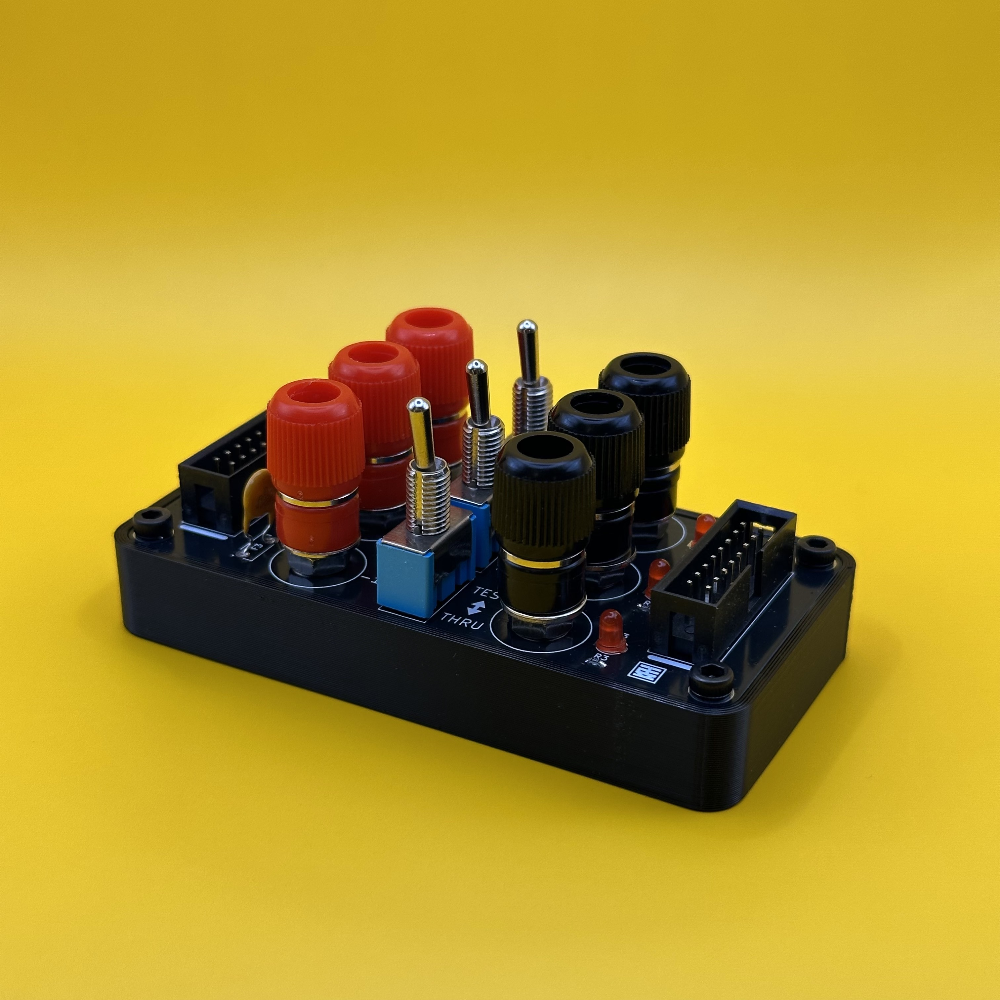

# Eurorack Power Consumption Tester

## 概要 / Overview

**Eurorack Power Consumption Tester** は、モジュラーシンセサイザーの消費電力を測定するための治具です。  
デジタルマルチメーター（テスター）と組み合わせて使用し、+5V、+12V、-12Vの各電源レールにおける消費電流の測定が可能です。

**Eurorack Power Consumption Tester** is a utility jig for measuring the power consumption of modular synthesizers.  
Used in combination with a digital multimeter, it allows measurement of current draw on +5V, +12V, and -12V rails.

## 仕様 / Spec
- Format: External testing tool (not a rack-mounted module)  
- Function: Power Consumption Tester Jig
- Current needs: +12V: 0mA, -12V: 0mA (Passive)
- Width: 0 HP
- Depth: 10mm

## 販売 / Sales

現在販売予定はありません。

## ライセンス / License

この作品は [Creative Commons 表示 - 継承 4.0 国際 (CC BY-SA 4.0)](https://creativecommons.org/licenses/by-sa/4.0/deed.ja) の下でライセンスされています。  
This work is licensed under the [Creative Commons Attribution-ShareAlike 4.0 International License](https://creativecommons.org/licenses/by-sa/4.0/).

## クレジット / Credits

- Designed by : StudioKAT
- Website : https://www.studiokat.jp/
- GitHub : https://github.com/StudioKAT
- X(Twitter) : https://x.com/StudioKAT_synth
- Instagram : https://www.instagram.com/studiokat_modular/

## 更新履歴 / Changelog

- `2025-04-24` v1.0 Released version 1.0  