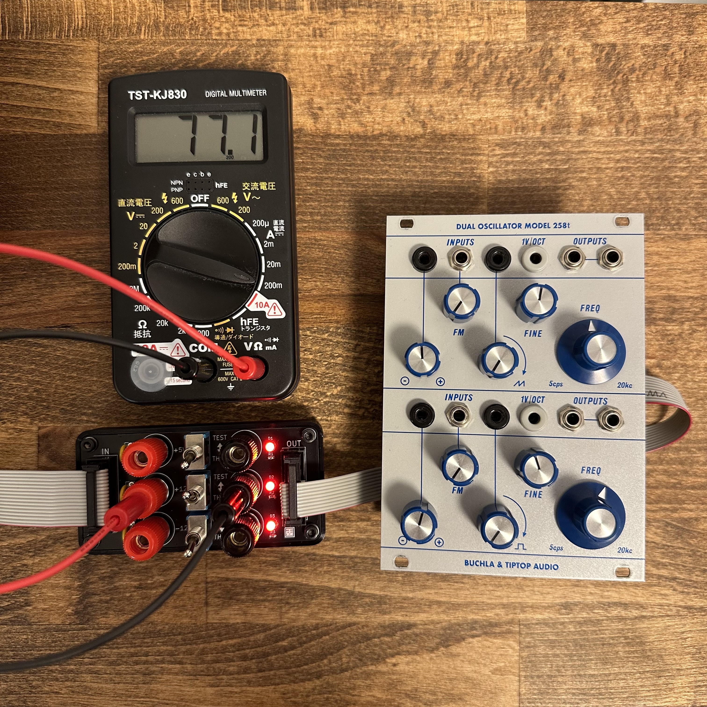

# Eurorack Power Consumption Tester マニュアル（日本語）

## 概要

**Eurorack Power Consumption Tester** は、モジュラーシンセサイザーの消費電力を測定するための治具です。  
デジタルマルチメーター（テスター）と組み合わせて使用し、+5V、+12V、-12Vの各電源レールにおける消費電流の測定が可能です。

---

## 仕様

- **フォーマット**：非モジュール型（外付けツール）  
- **幅**：0 HP（ユーロラックケースにマウント不要）  
- **奥行き**：10 mm  
- **消費電流**：+12V: 0mA / -12V: 0mA（パッシブ）

---

## 部品リスト

- [バインディングポスト（赤）MB-124-N-RED](https://akizukidenshi.com/catalog/g/g114241/) ×3  
- [バインディングポスト（黒）MB-124-N-BLACK](https://akizukidenshi.com/catalog/g/g114242) ×3  
- [リセッタブルヒューズ 0.5A（トリップ電流：1A、耐圧：60V）MF-R050](https://akizukidenshi.com/catalog/g/g112628/) ×3  
- [3Pトグルスイッチ（1回路2接点）パネル取付用](https://akizukidenshi.com/catalog/g/g103774/) ×3  
- [3mm赤色LED OSR5JA3Z74A（625nm、70度）](https://akizukidenshi.com/catalog/g/g111577/) ×3  
- [IDCボックスヘッダー 16P（2×8）](https://ja.aliexpress.com/item/1005004266492521.html) ×2  
- チップ抵抗 0603（1608） 1kΩ ×1  
- チップ抵抗 0603（1608） 2.2kΩ ×2

### その他必要なもの

- バナナケーブル ×2  
- デジタルマルチメーター ×1  
- 16P-16P IDCフラットケーブル ×1  
- 16P-10P IDCフラットケーブル ×1

---

## 組立時の注意点

- 低背部品（チップ抵抗など）から順に取り付けると作業が容易です。  
- LEDは角型パッドがカソード（マイナス極）です。  
- バインディングポストのナットを締める際、レジスト（絶縁層）を傷つけないよう注意してください。  
  レジストが削れて露出するとGNDと短絡し、正しく動作しなくなる可能性があります。

---

## 使用方法

1. ケースの電源が**オフ**であることを確認する。  
2. 16P-16Pケーブルで、ケースの電源と測定治具の**IN端子**を接続する。  
3. 全てのスイッチ（+5V, +12V, -12V）を**THRU**側に倒す。  
4. 測定治具の**OUT端子**と検査対象のモジュールを16P-10Pケーブルで接続する。  
5. ケースの電源をオンにし、LEDが点灯することを確認する。  
6. バナナケーブルでテスターと治具の対応端子（+/-）を接続し、テスターを**電流測定モード**に設定する。  
7. 各スイッチを**TEST側**に倒すと、該当電源がテスター経由で供給されるようになり、電流値を測定できる。  
8. モジュールに最大負荷をかけた状態で、消費電流を確認する。

> ⚠ **注意**：電源オン時のケーブルの抜き差しは絶対に行わないでください。  
> 本製品使用中に発生したいかなる損害についても、責任を負いかねます。

---

## ライセンス

この作品は [Creative Commons 表示 - 継承 4.0 国際 (CC BY-SA 4.0)](https://creativecommons.org/licenses/by-sa/4.0/deed.ja) の下でライセンスされています。

---

## クレジット

- **Designed by**：StudioKAT  
- **Website**：[https://www.studiokat.jp/](https://www.studiokat.jp/)  
- **GitHub**：[https://github.com/StudioKAT](https://github.com/StudioKAT)  
- **X（旧Twitter）**：[https://x.com/StudioKAT_synth](https://x.com/StudioKAT_synth)  
- **Instagram**：[https://www.instagram.com/studiokat_modular/](https://www.instagram.com/studiokat_modular/)

---

## 更新履歴

- `2025-04-24`：v1.0 リリース  
